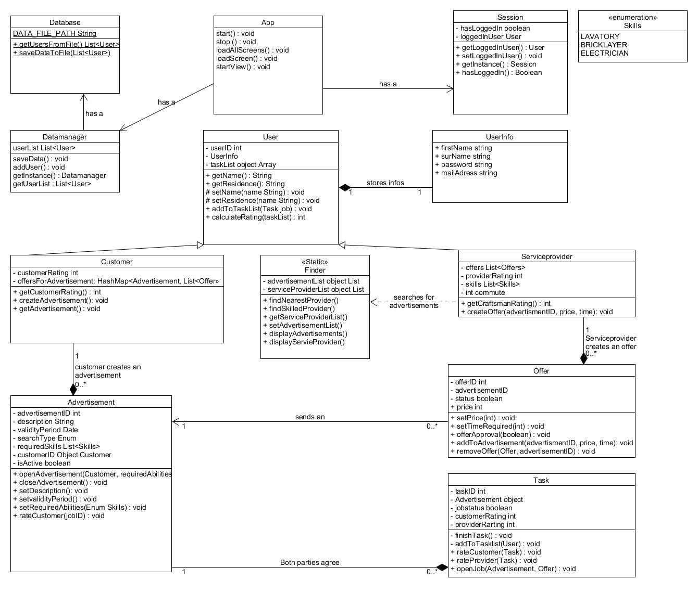

# Class Diagram

Here we describe our class structure of this project NeedAHand.

## Overview

This is a class diagram of our project NeedAHand. The diagram shows the classes and their relationships. 
The classes are split into three packages: `ui`, `model` and `resources/views`. 

### `ui`

This package contains all classes related to the main userinterface (App, Session, ProfileControllers, HomeControllers and the LoginController).
The ui is responsible for the user interaction with the application. It acts as a bridge between the user and the model.

### `model`
This model package contains all classes related to the data of the application.
The model is responsible for the data management of the application. 
Furthermore, this package contains the information for the ui and the views.

### `view`
This view package contains all classes related to the views of the application. The views are shown to the user. 
And the user can interact with it by using the keyboard or the mouse.
The views work with the ui and the model to show the data to the user.
 