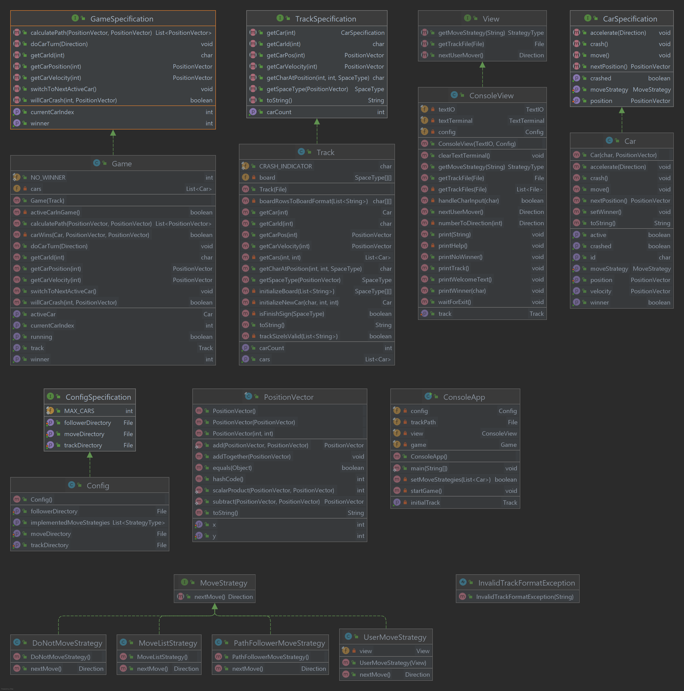

# gruppe3-Projekt1-GUnit-Racetrack
Version 1.0 25.03.2022 @authors: Valentin Egger, Thomas Funhoff

## Setup
1. Clone the repository: git clone https://github.zhaw.ch/PM2-IT21aWIN-fame-rayi-wahl/IT21aWIN-gruppe3-GUnit-Racetrack.git
2. Install Java 17.0.1 if not already installed (other version may be ok)
3. Install Gradle 7.3.3 if not already installed (other version may be ok)
4. Open a terminal
5. Go forward to the location of the project file
6. Put in `gradle run`

## Game
### Workflow/Direction
The first step of playing the game Racetrack will be to choose a track to race on. The following ones are given:
```
1. challenge.txt
2. oval-anticlock-right.txt
3. oval-clock-up.txt
4. quarter-mile.txt
```

After your track was chosen, you must determine what move strategy your car will have.
```
Now choose a move strategy for car a:
 1: DO_NOT_MOVE
 2: USER
Enter your choice:
```
*SideNote: The amout of cars, that will be on the track, are determined by the track itself!*

If you have successfully chosen the strategys, you are now able to play the game.

### How to play
After the setup-phase is completed, you will be able to see your choosen track with it's cars on it. To move your car you will be asked to put in a number between 1-9, you can also use h for help, q for quit or t for track. Like the following:
```
Car a it's your turn:
Acceleration direction (h for help) (1, 2, 3, 4, 5, 6, 7, 8, 9):
```
Your car will move accordingly, with an acceleration speed that can be increased or decreased depending on the input. 
If you choose back-to-back 4s as an input, then your car will accelerate with a speed of x:-2 y:0. With a first input as 6 and second as 9, your speed will be x:2 y:1.
The game will end, when the first car reaches the finish-line or when only one car is still standing.

#### Acceleration vectors
Use the below table as a reference:
|vectors|vectors|vectors|
|---|---|---|
|1, (-1, -1)|2, (0,-1)|3, (1,-1)|
|4, (-1,0)|5, (0,0)|6, (1,0)|
|7, (-1,1)|8, (0,1)|9, (1,1)|

Or use the help function in the game:
```
Acceleration Directions: 
1  2  3    1 = UP-LEFT     2 = UP      3 = UP-RIGHT
4  5  6    4 = LEFT        5 = NONE    6 = RIGHT
7  8  9    7 = DOWN-LEFT   8 = DOWN    9 = DOWN-RIGHT
h for help
t to show track
q to quit game
```
### Class diagram
The diagram presents a clear overview of our classes in Racetrack. The methods and variables are all on displayed, inwhich a user is abel to see the structur and with who the classes are in dependencies with.


### Branching
We used the `feature branches` methode for this project. The main branch has always the most stable and executable stand. The same thing applies for the dev branch. In this branch the bugs will be solved, before it will be pushed to the main branch. For any other or new featuers, a feature-branch will be checked out from dev.
